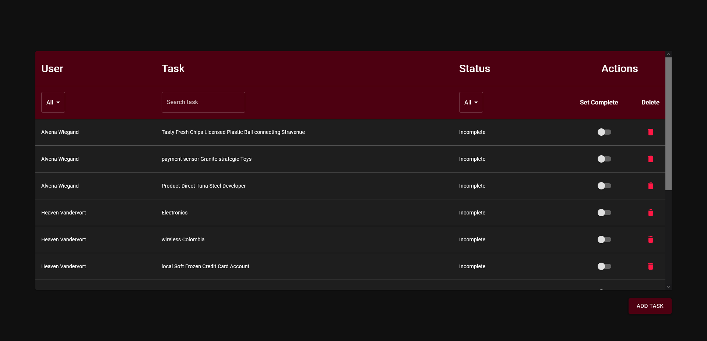
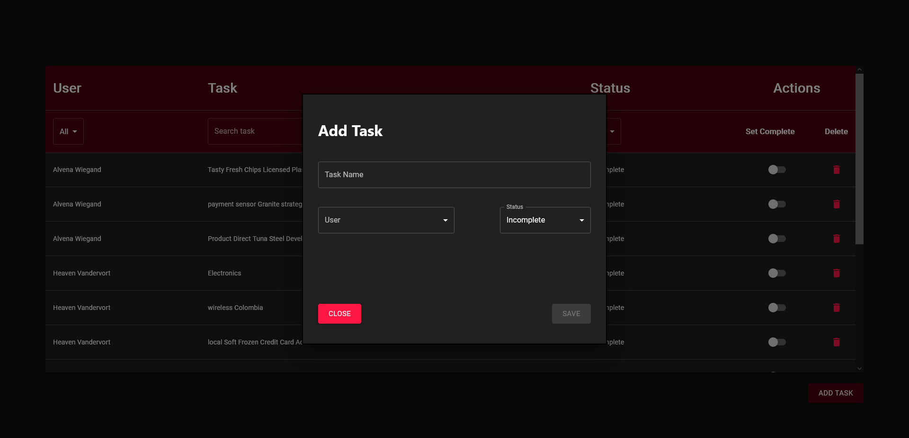

This project was bootstrapped with [Create React App](https://github.com/facebook/create-react-app).

## Steps setup to the App 
- npm install
- npm start 

## Packages Used
- [Material UI](https://material-ui.com/)
- Typescript

### Functionality included
- List Tasks
- Filter tasks by name, user, is completed
- Add Task
- Edit Task
- Delete Task
- Global State (React Hooks and Context Providers)

### Screenshots 

